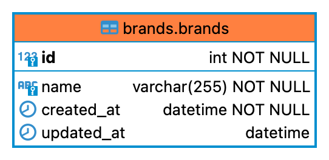

# Sportissimo test app

Installing local version of the project
==================================

### Pre-install ###
1. Install the [docker](https://docs.docker.com/get-docker/) into your local device.
2. Install the [docker-compose](https://docs.docker.com/compose/install/) into your local device.
3. Install the `Make` (Mac - https://formulae.brew.sh/formula/make. Linux - `sudo apt install build-essential`).

### Main install ###
1. Clone the repository into your local device: `git clone https://github.com/barmax/sportissimo test_app`.
2. Go to the project folder: `cd test_app`.
3. Build containers for the project: `make build-dev`.
4. Install project dependencies: `make install`.
5. Create db-table: `make create-table`.
6. Go to the link [http://localhost:8081](http://localhost:8081).
7. Click the button `Seed the database`.

### Useful commands ###
`make down-dev` stops all started containers.
`make shell` goes a command line into the application container.

### Database ###

`id` AUTO_INCREMENT PRIMARY KEY

`name` UNIQUE KEY

